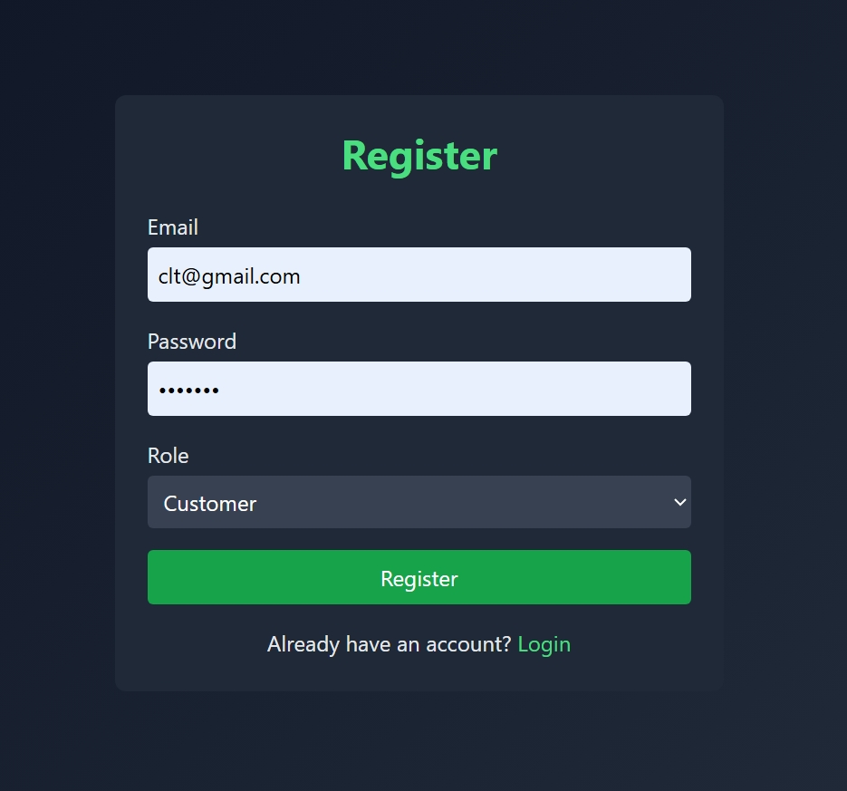
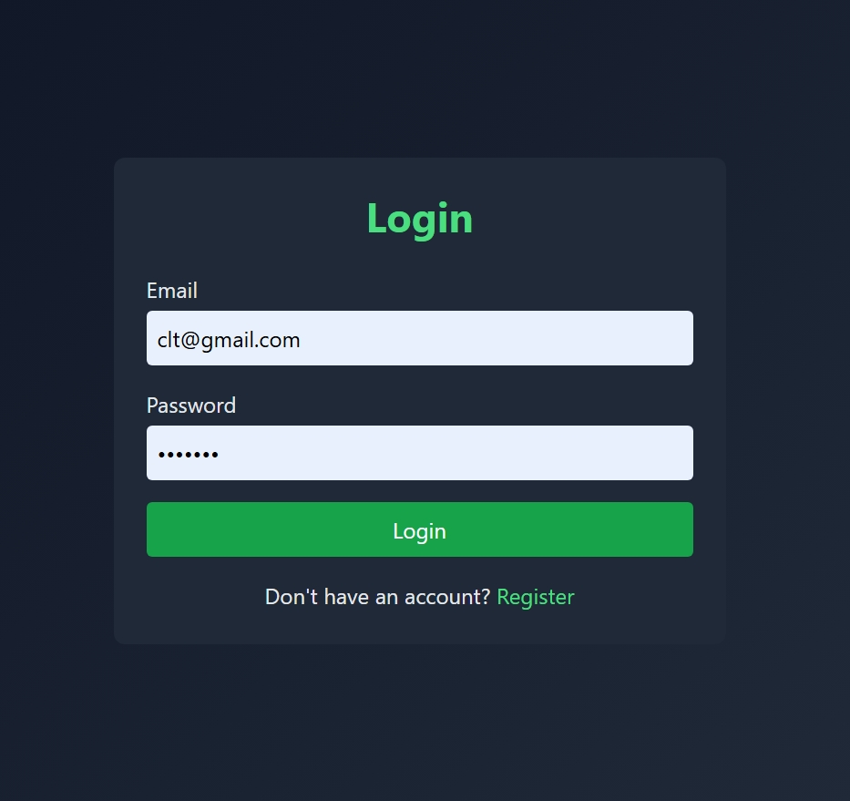
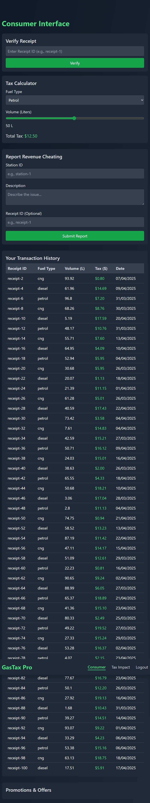
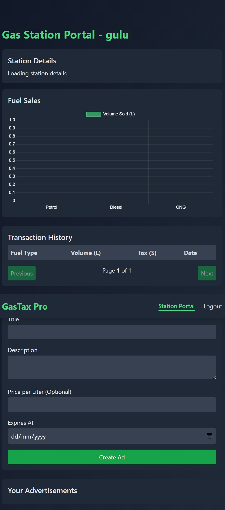
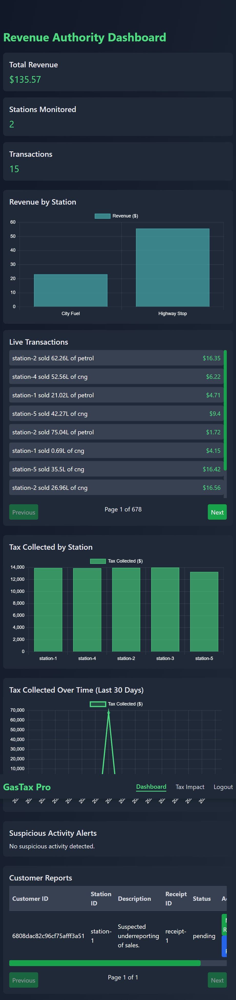

# GasTax Pro

A full-stack application for tracking gas transactions, calculating taxes, and managing advertisements. Built with Node.js, Express, MongoDB, React, and TailwindCSS.

## Table of Contents
- [Project Structure](#project-structure)
- [Features](#features)
- [Screenshots](#screenshots)
- [Prerequisites](#prerequisites)
- [Setup Instructions](#setup-instructions)
- [Usage](#usage)
- [Contributing](#contributing)
- [License](#license)

## Project Structure
- `backend/`: Node.js/Express/MongoDB backend with Socket.IO for real-time transaction updates.
- `frontend/`: React/Vite/TailwindCSS frontend with Chart.js for visualizations and Framer Motion for animations.

## Features
- Three user roles: Customer, Gas Station, and Revenue Authority.
- Real-time transaction tracking via Socket.IO.
- Tax calculation and analytics with Chart.js visualizations.
- Advertisement management for gas stations.
- Customer transaction history and reporting.
- Pagination for large datasets (transactions and reports).
- Secure JWT authentication with rate limiting using `express-rate-limit`.

## Screenshots
A visual overview of the application:

### Register Dashboard

The registration interface for new users to create accounts.

### Login Dashboard

The login interface for user authentication.

### Consumer Interface

The customer dashboard for tracking transactions and viewing reports.

### Gas Station Interface

The gas station dashboard for managing advertisements and transactions.

### Revenue Authority Interface

The revenue authority dashboard for tax calculations and analytics.

## Prerequisites
- Node.js (v16 or higher)
- MongoDB (local or MongoDB Atlas)
- Git

## Setup Instructions

### Backend
1. Navigate to the backend directory:
   ```bash
   cd backend